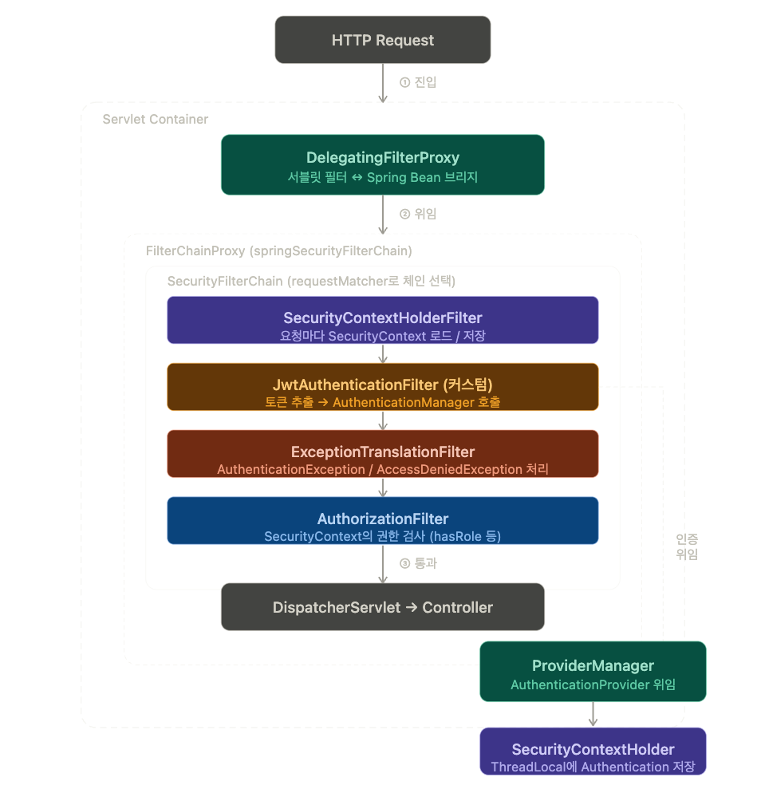

## Security Architecture

### DelegatingFilterProxy
- 서블릿 컨테이너(Tomcat)와 스프링 컨테이너 사이를 연결하는 **다리** 역할
- Was는 스프링 빈을 직접 인식하지 못해 DelegatingFilterProxy가 서블릿 필터로 등록되어 요청을 가로챈다.
- 가로 챈 뒤 FilterChainProxy에게 처리를 위임한다.
- 한마디로 요청이 오면 SecurityFilterChain로 넘겨주는 역할이라 보면 된다.

### FilterChainProxy
- 여러개의 SecurityFilterChain 리스트 관리
  - SecurityContextHolderFilter, JwtAuthenticationFilter, ExceptionTranslationFilter, AuthorizationFilter 

### SecurityContextHolderFilter
- 요청마다 Security Context를 생성/유지하고 요청이 끝나면 이를 깨끗이 비워주는 역할
- 요청이 들어올 떄
  - 저장소 확인   : 보안(세션) 정보 있는지 확인
  - 컨텍스트 로드 : 보안정보가 없다면 Security Context 생성, 있다면 가져온다.
  - 홀더 설정    : 생성된 Context를 SecurityContextHolder에 저장
- 요청이 끝날 떄
  - 요청처리가 끝나면 컨텍스트를 비운다.(정보를 삭제)

### JwtAuthenticationFilter
- 토큰 검증 > 헤더에서 토큰을 꺼내 유효성 확인

### AuthorizationFilter
- anyRequest().authenticated() 설정로직 해당
- SecurityContextHolder에서 인증정보가 있는지 확인 후 통과 시킬지 거부할지 결정

### ExceptionTranslationFilter
- AuthorizationFilter에서 인증 정보가 없거나 권한 부족 예외가 발생하면, 해당 필터가 예외를 잡아 클라이언트에게 응답을 보내준다.